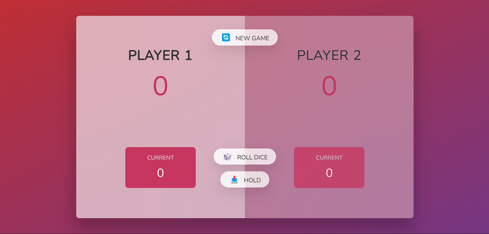
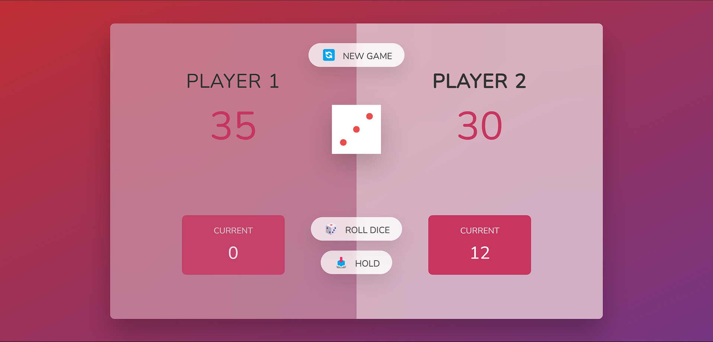
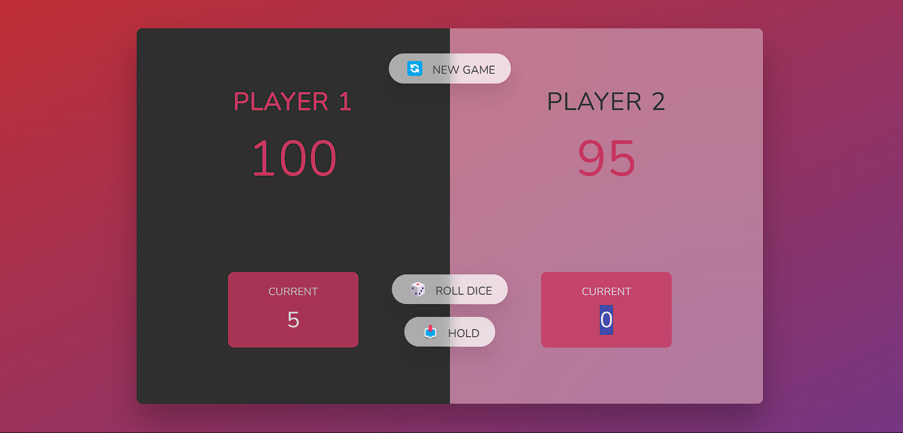

# 🎲 Dice Duel Game

**Dice Duel Game** is a fun and interactive two-player game where players roll dice and hold their scores strategically to reach 100 points before their opponent.

## 🚀 Features
- 🎲 Roll the dice to earn points.
- 🔄 Switch turns when rolling a 1.
- 💾 Hold your score to save progress.
- 🏆 First player to reach 100 wins!
- 🎨 Clean and modern UI.

## 🖥️ Technologies Used
- HTML
- CSS
- JavaScript

## 📸 Screenshots
### 🆕 New Game


### 🎮 Gameplay


### 🏆 Winning Screen


## 🎮 How to Play
1. **Roll the Dice 🎲** - Click on the "Roll Dice" button.
2. **Hold Your Score 🏅** - Click "Hold" to save your current points.
3. **Switch Players 🔄** - If you roll a 1, your turn ends automatically.
4. **Win the Game 🏆** - First to reach 100 points wins!

## 📂 Folder Structure
```
📦 Dice-Duel-Game
│── 📂 assets             # Dice images
│   ├── dice-1.png
│   ├── dice-2.png
│   ├── dice-3.png
│   ├── dice-4.png
│   ├── dice-5.png
│   ├── dice-6.png
│── 📂 images             # Screenshots of game
│   ├── Gameplay-Screen.png
│   ├── New-Screen.png
│   ├── Winning-Screen.png
│── 📜 index.html         # Game interface
│── 📜 script.js          # Game logic
│── 📜 style.css          # Game styling
│── 📜 README.md          # Project documentation
```

## 🛠️ Installation
1. Clone the repository:
   ```sh
   git clone https://github.com/Muqaddaspreet/Dice-Duel-game.git
   ```
2. Navigate to the project folder:
   ```sh
   cd Dice-Duel-game
   ```
3. Open `index.html` in your browser to start playing.

## 📬 Contact
For any queries or contributions, feel free to reach out via
- 👨‍💻 **Muqaddaspreet Singh Bhatia**
- 📫 Email: *(muqaddaspreetsb@gmail.com)*
- 🌐 GitHub: [Muqaddaspreet](https://github.com/Muqaddaspreet)
